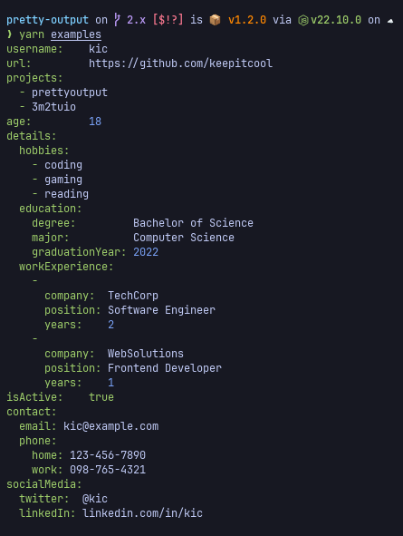

# @tduyng/prettyoutput

**@tduyng/prettyoutput** is a fast, customizable library for formatting JavaScript/JSON objects into a human-readable, YAML-style output.

[](https://www.npmjs.com/package/@tduyng/prettyoutput)
[](https://npmcharts.com/compare/@tduyng/prettyoutput?minimal=true)
[](https://github.com/tduyng/prettyoutput/actions/workflows/ci.yml)
[](https://coveralls.io/github/tduyng/prettyoutput?branch=master)

## Features

- Fast — 2–3x faster than `util.inspect`
- Configurable — colors, depth, indentation, etc.
- Cross-platform — Node.js, Deno, Bun, and CLI
- ESM and CommonJS support
- TypeScript-first, with full type safety
- Zero dependencies
- Tested with high coverage

---

Let me know if you want a shorter or more opinionated tone (e.g., for dev-focused landing pages).

## Installation

```bash
npm  add @tduyng/prettyoutput
yarn add @tduyng/prettyoutput
pnpm add @tduyng/prettyoutput
```

## Usage

**@tduyng/prettyoutput** is extremely easy to use. Just require it in your project and call the function with your data:

```javascript
import { prettyOutput } from '@tduyng/prettyoutput'

const data = {
    username: 'tduyng',
    url: 'https://github.com/tduyng',
    projects: ['@tduyng/prettyoutput', '@tduyng/logger'],
}

console.log(prettyOutput(data))
```

Sample output:

```bash
username: tduyng
url: https://github.com/tduyng
projects:
  - @tduyng/prettyoutput
  - @tduyng/logger
```

Other example:



## API

`prettyOutput(data, options, indent)`

### Parameters

```md
- {\*} data : The JavaScript or JSON object to format
- {Object} [options] : Optional. See options below
- {number} [indent] : Optional. Indent all output
```

### Options

```md
- {number} [indentationLength] : Length of indentation (in terms of space)
- {number} [maxDepth] : maximum sublevel of nested objects/arrays output. Default: 3
- {boolean}[noColor] : disable colors. Default: false
- {colors} [colors] : Output colors. See below
- {boolean}[alignKeyValues] : Align key values. Default: true
- {boolean}[hideUndefined] : Do not display undefined values. Default: false
```

### Colors Options

```md
- {string} [keys] : Objects keys color. Default: green
- {string} [dash] : Array prefixing dash ("- "). Default: green
- {string} [number] : Numbers color. Default: blue
- {string} [string] : Strings color. Default: no color
- {string} [true] : Boolean value 'true' color. Default: green
- {string} [false] : Boolean value 'false' color. Default: red
- {string} [null] : 'Null' color. Default: grey
- {string} [undefined] : 'Undefined' color. Default: grey
```

Example using options :

```javascript
import { prettyOutput } from '@tduyng/prettyoutput'

const data = {
    username: 'tduyng',
    url: 'https://github.com/tduyng',
    projects: ['@tduyng/prettyoutput', '@tduyng/logger'],
}

const options = {
    noColor: true,
    maxDepth: 5,
    colors: {
        keys: 'blue',
        null: 'red',
    },
}

console.log(prettyOutput(data, options, 2))
```

## CLI Usage

You can also use prettyoutput directly from the command line to format files or standard input.

## CLI Usage

You can also use prettyoutput directly from the command line to format files or standard input.

### Available Aliases

There are multiple aliases available for the CLI, allowing you to use the command that best fits your workflow:

```bash
# Pretty print a JSON file
pretty package.json             # for ESM
prettyoutput package.json       # for ESM
pretty-cjs package.json         # for CJS
prettyoutput-cjs package.json   # for CJS
```

Example CLI Output:


### Command Line Options

- `--indent`: Set the indentation level (default: 2).
- `--depth`: Limit the depth of object printing (default: 3).
- `--noColor`: Disable colored output.

```bash
# Format with custom indentation, depth, and no color
prettyoutput --indent=4 --depth=5 --noColor package.json
```

or

```bash
# Indent 4, max depth 5, disable colors
cat package.json | prettyoutput --indent=4 --depth=5 --noColor
```

```bash
# Pretty print a JSON file
prettyoutput package.json       # for ESM
pretty package.json             # for ESM
prettyoutput-cjs package.json   # for CJS
pretty-cjs package.json         # for CJS
```

Example CLI Output:


### Command Line Options

- `--indent`: Set the indentation level (default: 2).
- `--depth`: Limit the depth of object printing (default: 3).
- `--noColor`: Disable colored output.

```bash
# Format with custom indentation, depth, and no color
prettyoutput --indent=4 --depth=5 --noColor package.json
```

or

```bash
# Indent 4, max depth 5, disable colors
cat package.json | prettyoutput --indent=4 --depth=5 --noColor
```

## Benchmark

Performance is key for logging, and prettyoutput is built to be fast. Compared to alternatives like `util.inspect` and `prettyjson`, it consistently performs 2x-3x times faster.

### Run Benchmarks

```bash
pnpm run benchmark
```

### Benchmark Results

Tested on Node.js 24.8.0

```bash
LEVELS | KEYS | LOOPS | WEIGHTS
1      | 20   | 100   | serializable: 0.9    array: 0.3    object: 0.5    multilineString: 0.3    error: 0.2

NAME             | MIN        | MAX           | MEAN       | TOTAL
prettyoutput     | 6µs 834ns  | 2ms 8µs 875ns | 36µs 267ns | 3ms 626µs 709ns
prettyjson       | 13µs 792ns | 344µs 875ns   | 26µs 445ns | 2ms 644µs 583ns
util.inspect     | 10µs 875ns | 150µs 375ns   | 16µs 815ns | 1ms 681µs 588ns
@poppinss/dumper | 43µs 209ns | 961µs 959ns   | 76µs 326ns | 7ms 632µs 670ns
--------------------------------------------------------------------------------------------------------------


LEVELS | KEYS | LOOPS | WEIGHTS
2      | 20   | 100   | serializable: 0.9    array: 0.3    object: 0.5    multilineString: 0.3    error: 0.2

NAME             | MIN         | MAX         | MEAN        | TOTAL
prettyoutput     | 27µs 875ns  | 454µs 83ns  | 42µs 807ns  | 4ms 280µs 793ns
prettyjson       | 58µs 583ns  | 163µs 541ns | 73µs 734ns  | 7ms 373µs 456ns
util.inspect     | 101µs 625ns | 583µs 542ns | 123µs 526ns | 12ms 352µs 668ns
@poppinss/dumper | 171µs 458ns | 510µs 250ns | 207µs 106ns | 20ms 710µs 623ns
--------------------------------------------------------------------------------------------------------------


LEVELS | KEYS | LOOPS | WEIGHTS
3      | 20   | 100   | serializable: 0.9    array: 0.3    object: 0.5    multilineString: 0.3    error: 0.2

NAME             | MIN             | MAX             | MEAN            | TOTAL
prettyoutput     | 346µs 875ns     | 3ms 814µs 709ns | 460µs 657ns     | 46ms 65µs 759ns
prettyjson       | 807µs 750ns     | 1ms 256µs 667ns | 899µs 45ns      | 89ms 904µs 586ns
util.inspect     | 1ms 419µs 625ns | 1ms 874µs 375ns | 1ms 532µs 755ns | 153ms 275µs 587ns
@poppinss/dumper | 2ms 640µs 584ns | 3ms 596µs 666ns | 2ms 954µs 927ns | 295ms 492µs 722ns
--------------------------------------------------------------------------------------------------------------


LEVELS | KEYS | LOOPS | WEIGHTS
4      | 20   | 100   | serializable: 0.9    array: 0.3    object: 0.5    multilineString: 0.3    error: 0.2

NAME             | MIN              | MAX              | MEAN             | TOTAL
prettyoutput     | 3ms 593µs 333ns  | 28ms 998µs 208ns | 4ms 444µs 335ns  | 444ms 433µs 545ns
prettyjson       | 6ms 779µs 125ns  | 8ms 323µs 292ns  | 7ms 344µs 228ns  | 734ms 422µs 834ns
util.inspect     | 13ms 944µs 666ns | 23ms 601µs 458ns | 15ms 140µs 162ns | 1s 514ms 16µs 206ns
@poppinss/dumper | 31ms 645µs 458ns | 44ms 678µs 500ns | 35ms 198µs 832ns | 3s 519ms 883µs 256ns
--------------------------------------------------------------------------------------------------------------


LEVELS | KEYS | LOOPS | WEIGHTS
4      | 20   | 200   | serializable: 0.9    array: 0.3    object: 0.5    multilineString: 0.3    error: 0.2

NAME             | MIN              | MAX              | MEAN             | TOTAL
prettyoutput     | 2ms 472µs 375ns  | 19ms 756µs 416ns | 2ms 841µs 423ns  | 568ms 284µs 792ns
prettyjson       | 3ms 983µs 584ns  | 5ms 516µs 375ns  | 4ms 419µs 219ns  | 883ms 843µs 868ns
util.inspect     | 14ms 861µs 417ns | 23ms 170µs 792ns | 16ms 48µs 375ns  | 3s 209ms 675µs 126ns
@poppinss/dumper | 20ms 774µs 625ns | 28ms 990µs 41ns  | 23ms 617µs 484ns | 4s 723ms 496µs 967ns
--------------------------------------------------------------------------------------------------------------


LEVELS | KEYS | LOOPS | WEIGHTS
5      | 10   | 100   | serializable: 0.9    array: 0.3    object: 0.5    multilineString: 0.3    error: 0.2

NAME             | MIN             | MAX             | MEAN            | TOTAL
prettyoutput     | 540µs 542ns     | 3ms 999µs 667ns | 644µs 326ns     | 64ms 432µs 622ns
prettyjson       | 968µs 0ns       | 1ms 804µs 625ns | 1ms 105µs 952ns | 110ms 595µs 295ns
util.inspect     | 2ms 859µs 959ns | 3ms 856µs 541ns | 3ms 128µs 76ns  | 312ms 807µs 666ns
@poppinss/dumper | 4ms 281µs 167ns | 5ms 567µs 291ns | 4ms 708µs 354ns | 470ms 835µs 455ns
--------------------------------------------------------------------------------------------------------------
```

For detailed benchmark results, refer to the [benchmark documentation](./benchmark/README.md).

## Testing

Clone the repository and install development dependencies:

```bash
pnpm install
```

Run tests:

```bash
pnpm run test
# or pnpm run coverage
```

## Contribution

If you'd like to contribute to this project, feel free to submit issues and pull requests. Contributions are always welcome!

## Credits

**@tduyng/prettyoutput** is based on the original [prettyoutput](https://github.com/keepitcool/prettyoutput) project, which is now archived. Special thanks to [@bnadim](https://github.com/bnadim) for creating the original project, and to all contributors who helped enhance it over time.
