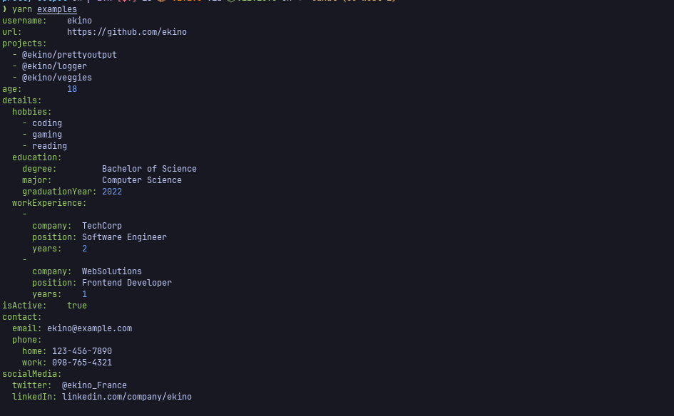
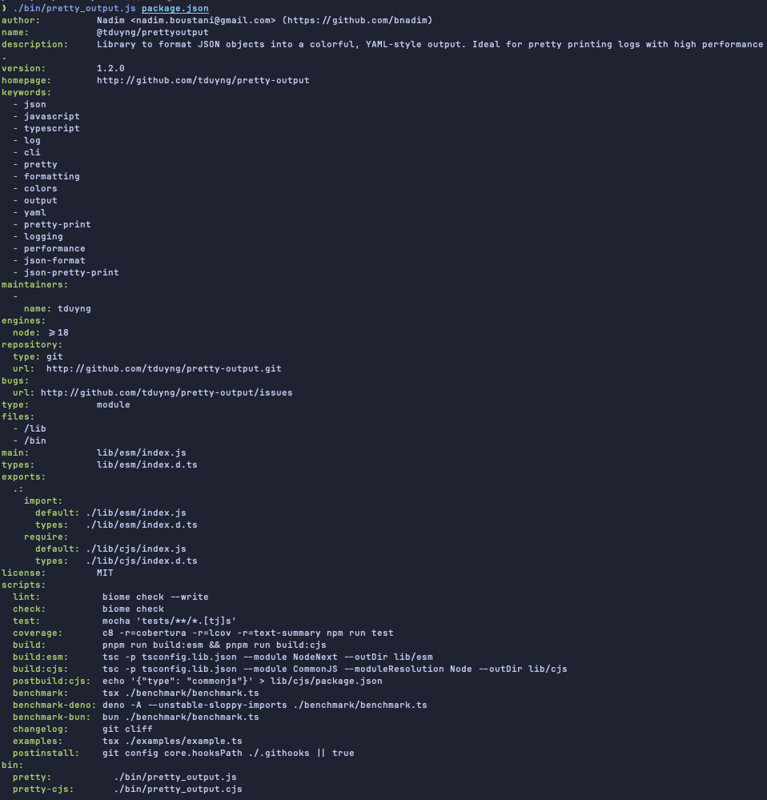

# @ekino/prettyoutput

**@ekino/prettyoutput** is a fast, customizable library for formatting JavaScript/JSON objects into a human-readable, YAML-style output. 

[](https://www.npmjs.com/package/@ekino/prettyoutput)
[](https://npmcharts.com/compare/@ekino/prettyoutput?minimal=true)
[](https://github.com/ekino/prettyoutput/actions/workflows/ci.yml)
[](https://coveralls.io/github/ekino/prettyoutput?branch=master)

## Features

- **High Performance**: Optimized to be 1.x-3.x times faster and more beautiful than `util.inspect`, making it ideal for real-time logging.
- **Customizable**: Configure indentation, color schemes, depth limits, and more to fit your specific needs.
- **Versatile**: Works as both a `Node.js`, `Deno`, `Bun` library and a CLI tool, giving flexibility for scripts and terminal usage.
- **Color Output**: Easily distinguish keys, strings, numbers, and more with customizable color formatting.
- **Dual Package**: Supports both ES modules and CommonJS, ensuring compatibility with various JavaScript environments.
- **TypeScript Support**: Fully written in TypeScript, offering type safety and modern development practices.
- **Simple and Tested**: Designed for ease of use with a thoroughly tested codebase.
- **Zero Dependencies**: Uses only `commander.js` for the CLI.

## Installation

```bash
npm  add @ekino/prettyoutput
yarn add @ekino/prettyoutput
pnpm add @ekino/prettyoutput
```

## Usage

**@ekino/prettyoutput** is extremely easy to use. Just require it in your project and call the function with your data:

```javascript
import { prettyOutput } from '@ekino/prettyoutput'

const data = {
  username: 'ekino',
  url: 'https://github.com/ekino',
  projects: ['@ekino/prettyoutput', '@ekino/logger']
}

console.log(prettyOutput(data))
```

Sample output:

```bash
username: ekino
url: https://github.com/ekino
projects:
  - @ekino/prettyoutput
  - @ekino/logger
```

Other example:



## API

`prettyOutput(data, options, indent)`
### Parameters
```md
 * {*} data                     : The JavaScript or JSON object to format
 * {Object} [options]           : Optional. See options below
 * {number} [indent]            : Optional. Indent all output
```

### Options
```md
 * {number} [indentationLength] : Length of indentation (in terms of space)
 * {number} [maxDepth]          : maximum sublevel of nested objects/arrays output. Default: 3
 * {boolean}[noColor]           : disable colors. Default: false
 * {colors} [colors]            : Output colors. See below
 * {boolean}[alignKeyValues]    : Align key values. Default: true
 * {boolean}[hideUndefined]     : Do not display undefined values. Default: false
```

### Colors Options
```md
 * {string} [keys]              : Objects keys color. Default: green
 * {string} [dash]              : Array prefixing dash ("- "). Default: green
 * {string} [number]            : Numbers color. Default: blue
 * {string} [string]            : Strings color. Default: no color
 * {string} [true]              : Boolean value 'true' color. Default: green
 * {string} [false]             : Boolean value 'false' color. Default: red
 * {string} [null]              : 'Null' color. Default: grey
 * {string} [undefined]         : 'Undefined' color. Default: grey
```

Example using options :
```javascript
import { prettyOutput } from '@ekino/prettyoutput'

const data = {
  username: 'ekino',
  url: 'https://github.com/ekino',
  projects: ['@ekino/prettyoutput', '@ekino/logger']
};

const options = {
  noColor: true,
  maxDepth: 5,
  colors: {
    keys: 'blue',
    null: 'red'
  }
};

console.log(prettyOutput(data, options, 2));
```

## CLI Usage

You can also use prettyoutput directly from the command line to format files or standard input.

## CLI Usage

You can also use prettyoutput directly from the command line to format files or standard input.

### Available Aliases

There are multiple aliases available for the CLI, allowing you to use the command that best fits your workflow:

```bash
# Pretty print a JSON file
pretty package.json             # for ESM
prettyoutput package.json       # for ESM
prettyOutput package.json       # for ESM
pretty-esm package.json         # for ESM
prettyoutput-esm package.json   # for ESM
prettyOutput-esm package.json   # for ESM
pretty-cjs package.json         # for CJS
prettyoutput-cjs package.json   # for CJS
prettyOutput-cjs package.json   # for CJS
```

Example CLI Output:



### Command Line Options

- `--indent`: Set the indentation level (default: 2).
- `--depth`: Limit the depth of object printing (default: 3).
- `--noColor`: Disable colored output.

```bash
# Format with custom indentation, depth, and no color
prettyoutput --indent=4 --depth=5 --noColor package.json
```

or

```bash
# Indent 4, max depth 5, disable colors
cat package.json | prettyoutput --indent=4 --depth=5 --noColor
```
```bash
# Pretty print a JSON file
prettyoutput package.json       # for ESM
pretty package.json             # for ESM
prettyoutput-esm package.json   # for ESM
pretty-esm package.json         # for ESM
prettyoutput-cjs package.json   # for CJS
pretty package.json             # for CJS
```

Example CLI Output:


### Command Line Options

- `--indent`: Set the indentation level (default: 2).
- `--depth`: Limit the depth of object printing (default: 3).
- `--noColor`: Disable colored output.

```bash
# Format with custom indentation, depth, and no color
prettyoutput --indent=4 --depth=5 --noColor package.json
```

or

```bash
# Indent 4, max depth 5, disable colors
cat package.json | prettyoutput --indent=4 --depth=5 --noColor
```

## Benchmark
Performance is key for logging, and prettyoutput is built to be fast. Compared to alternatives like `util.inspect` and `prettyjson`, it consistently performs 1.x-3.x times faster.

### Run Benchmarks
```bash
pnpm run benchmark
```

### Benchmark Results
Tested on Node.js 22.8.0

```bash
LEVELS | KEYS | LOOPS | WEIGHTS
3      | 20   | 100   | serializable: 0.9    array: 0.3    object: 0.5    multilineString: 0.3    error: 0.2

NAME             | MIN                 | MAX                 | MEAN                | TOTAL
prettyoutput    | 1 ms 417 µs 200 ns  | 35 ms 930 µs 467 ns | 2 ms 5 µs 439 ns    | 200 ms 543 µs 970 ns
prettyjson       | 4 ms 56 µs 696 ns   | 9 ms 317 µs 632 ns  | 4 ms 473 µs 214 ns  | 447 ms 321 µs 437 ns
util.inspect     | 3 ms 895 µs 505 ns  | 12 ms 743 µs 60 ns  | 4 ms 463 µs 826 ns  | 446 ms 382 µs 620 ns
@poppinss/dumper | 12 ms 185 µs 629 ns | 24 ms 81 µs 159 ns  | 14 ms 167 µs 609 ns | 1 s 416 ms 760 µs 966 ns
--------------------------------------------------------------------------------------------------------------


LEVELS | KEYS | LOOPS | WEIGHTS
4      | 20   | 100   | serializable: 0.9    array: 0.3    object: 0.5    multilineString: 0.3    error: 0.2

NAME             | MIN                 | MAX                  | MEAN                | TOTAL
prettyoutput    | 7 ms 741 µs 194 ns  | 118 ms 124 µs 145 ns | 11 ms 263 µs 170 ns | 1 s 126 ms 317 µs 3 ns
prettyjson       | 18 ms 281 µs 941 ns | 28 ms 144 µs 657 ns  | 19 ms 861 µs 800 ns | 1 s 986 ms 180 µs 75 ns
util.inspect     | 28 ms 601 µs 804 ns | 57 ms 71 µs 136 ns   | 31 ms 647 µs 947 ns | 3 s 164 ms 794 µs 787 ns
@poppinss/dumper | 61 ms 791 µs 290 ns | 94 ms 660 µs 42 ns   | 69 ms 241 µs 879 ns | 6 s 924 ms 187 µs 908 ns
--------------------------------------------------------------------------------------------------------------


LEVELS | KEYS | LOOPS | WEIGHTS
4      | 40   | 200   | serializable: 0.9    array: 0.3    object: 0.5    multilineString: 0.3    error: 0.2

NAME             | MIN                     | MAX                      | MEAN                     | TOTAL
prettyoutput    | 322 ms 378 µs 833 ns    | 2 s 470 ms 343 µs 997 ns | 408 ms 177 µs 619 ns     | 81 s 635 ms 523 µs 870 ns
prettyjson       | 413 ms 885 µs 631 ns    | 949 ms 765 µs 323 ns     | 498 ms 554 µs 581 ns     | 99 s 710 ms 916 µs 350 ns
util.inspect     | 728 ms 839 µs 615 ns    | 1 s 938 ms 281 µs 319 ns | 838 ms 188 µs 569 ns     | 167 s 637 ms 713 µs 859 ns
@poppinss/dumper | 1 s 389 ms 498 µs 39 ns | 2 s 445 ms 781 µs 141 ns | 1 s 634 ms 909 µs 384 ns | 326 s 981 ms 876 µs 857 ns
--------------------------------------------------------------------------------------------------------------


LEVELS | KEYS | LOOPS | WEIGHTS
5      | 20   | 100   | serializable: 0.9    array: 0.3    object: 0.5    multilineString: 0.3    error: 0.2

NAME             | MIN                  | MAX                      | MEAN                    | TOTAL
prettyoutput    | 201 ms 29 µs 587 ns  | 1 s 651 ms 200 µs 25 ns  | 245 ms 777 µs 771 ns    | 24 s 577 ms 777 µs 190 ns
prettyjson       | 229 ms 631 µs 36 ns  | 467 ms 527 µs 984 ns     | 269 ms 62 µs 662 ns     | 26 s 906 ms 266 µs 294 ns
util.inspect     | 828 ms 156 µs 412 ns | 1 s 884 ms 775 µs 777 ns | 920 ms 237 µs 642 ns    | 92 s 23 ms 764 µs 261 ns
@poppinss/dumper | 889 ms 54 µs 772 ns  | 1 s 323 ms 199 µs 230 ns | 1 s 14 ms 384 µs 206 ns | 101 s 438 ms 420 µs 665 ns
--------------------------------------------------------------------------------------------------------------
```
For detailed benchmark results, refer to the [benchmark documentation](./benchmark/README.md).

## Testing

Clone the repository and install development dependencies:

```bash
pnpm run install
```

Run tests:

```bash
pnpm run test
# or pnpm run coverage
```

## Contribution
If you'd like to contribute to this project, feel free to submit issues and pull requests. Contributions are always welcome!

## Credits

**@ekino/prettyoutput** is based on the original [prettyoutput](https://github.com/keepitcool/prettyoutput) project, which is now archived. Special thanks to [@bnadim](https://github.com/bnadim) for creating the original project, and to all contributors who helped enhance it over time.
